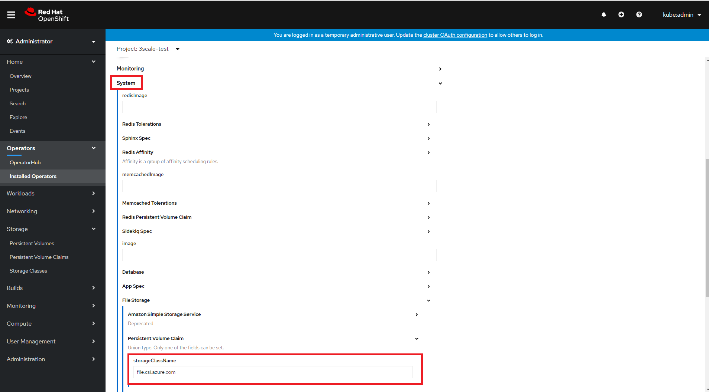

See also :

- [System requirements for installing 3scale on OpenShift](https://access.redhat.com/documentation/en-us/red_hat_3scale_api_management/2.9/html/installing_3scale/install-threescale-on-openshift-guide#deploying-threescale-using-the-operator)

- [Red Hat 3scale API Management Supported Configurations](https://access.redhat.com/articles/2798521)

- [https://github.com/3scale/3scale-operator/issues/547](https://github.com/3scale/3scale-operator/issues/547)


- [https://issues.redhat.com/browse/THREESCALE-4996](https://issues.redhat.com/browse/THREESCALE-4996)


- [https://docs.openshift.com/aro/4/storage/persistent_storage/persistent-storage-azure-file.html](https://docs.openshift.com/aro/4/storage/persistent_storage/persistent-storage-azure-file.html)

- [https://docs.openshift.com/aro/4/storage/persistent_storage/persistent-storage-csi.html](https://docs.openshift.com/aro/4/storage/persistent_storage/persistent-storage-csi.html)

- [https://docs.openshift.com/aro/4/storage/understanding-persistent-storage.html#types-of-persistent-volumes_understanding-persistent-storage](https://docs.openshift.com/aro/4/storage/understanding-persistent-storage.html#types-of-persistent-volumes_understanding-persistent-storage)

- [https://docs.openshift.com/aro/4/storage/persistent_storage/persistent-storage-azure.html#storage-create-azure-storage-class_persistent-storage-azure](https://docs.openshift.com/aro/4/storage/persistent_storage/persistent-storage-azure.html#storage-create-azure-storage-class_persistent-storage-azure)

- [https://github.com/container-storage-interface/spec](https://github.com/container-storage-interface/spec)

- [https://github.com/kubernetes-sigs/azuredisk-csi-driver](https://github.com/kubernetes-sigs/azuredisk-csi-driver)

- [https://github.com/kubernetes-sigs/azurefile-csi-driver](https://github.com/kubernetes-sigs/azurefile-csi-driver)

- [https://github.com/kubernetes-sigs/blob-csi-driver](https://github.com/kubernetes-sigs/blob-csi-driver)


# Default Storage in ARO

The default storage class in ARO4 is "managed-premium" which suppport RWO (ReadWriteOnce) and not RWX (ReadWriteMany) whereas 3Scale requires Persistent Volume Claims (PVC) with RWX access mode.

```sh
kind: StorageClass
apiVersion: storage.k8s.io/v1
metadata:
  name: managed-premium
  annotations:
    storageclass.kubernetes.io/is-default-class: 'true'
  ownerReferences:
    - apiVersion: v1
      kind: clusteroperator
      name: storage
provisioner: kubernetes.io/azure-disk
parameters:
  kind: Managed
  storageaccounttype: Premium_LRS
reclaimPolicy: Delete
allowVolumeExpansion: true
volumeBindingMode: WaitForFirstConsumer
```

This is why you need to create new storage classes using:
- Azure File (K8S in-tree) plugins untill they become deprecated and replaced by the CSI Drivers
- Azure File CSI Driver for Kubernetes or Azure Blob Storage CSI driver for Kubernetes

As ARO default [PVC storageClass](https://kubernetes.io/docs/concepts/storage/storage-classes/) in your cluster does not support RWX access mode 3Scale allow specifying the PVC storage class desired to be used for System's FileStorage PVC through the .spec.system.fileStorage.persistentVolumeClaim.storageClassName attribute for the [APIManager custom resource](https://github.com/3scale/3scale-operator/blob/3scale-2.9.1-GA/doc/apimanager-reference.md#SystemPVCSpec). In that way, you can point to a storage class that allows RWX PVCs.


# Pre-req

I assume you already have an ARO cluster up & running, if not please check the [README](./README.md)

## Check ARO cluster connectivity
```sh
oc login $aro_api_server_url -u $aro_usr -p $aro_pwd
oc whoami
oc cluster-info
```

## Create Namespaces
```sh
oc create namespace development
oc label namespace/development purpose=development

oc config current-context
oc status
oc projects
oc new-project 3scale-test --description="RedHat 3Scale" --display-name="ARO 3Scale PoC"
oc get ns 3scale-test
oc get project 3scale-test
oc label namespace/3scale-test purpose=3scale
oc describe project 3scale-test
```

# Create Storage Classes

## Check the default storage class
```sh
oc get sc
oc describe sc managed-premium
```


## Azure File (K8S in-tree plugin) 
```sh
cat <<EOF >> storageclass-azurefile-legacy.yaml
kind: StorageClass
apiVersion: storage.k8s.io/v1
metadata:
  name: azurefile-legacy
provisioner: kubernetes.io/azure-file
mountOptions:
  - dir_mode=0777
  - file_mode=0777
  - uid=0
  - gid=0
  - mfsymlinks
  - cache=strict
  - actimeo=30
parameters:
  skuName: Premium_LRS
EOF

oc apply -f storageclass-azurefile-legacy.yaml
oc get sc
oc describe sc azurefile-legacy

```

## CSI Drivers

### Azure Cloud Provider config 
```sh
oc apply -f https://raw.githubusercontent.com/ezYakaEagle442/aro-pub-storage/master/cnf/cloud-cfg-test-pod.yaml
oc describe pvc test-host-pvc
oc describe pv test-host-pv
oc describe pod test-pod
oc get po
oc exec -it test-pod -- cat /mnt/k8s/cloud.conf

oc describe secret azure-cloud-provider -n kube-system
azure_cnf_secret=$(oc get secret azure-cloud-provider -n kube-system -o jsonpath="{.data.cloud-config}" | base64 --decode)
echo "Azure Cloud Provider config secret " $azure_cnf_secret

azure_cnf_secret_length=$(echo -n $azure_cnf_secret | wc -c)
echo "Azure Cloud Provider config secret length " $azure_cnf_secret_length

aadClientId="${azure_cnf_secret:13:36}"
echo "aadClientId " $aadClientId

aadClientSecret="${azure_cnf_secret:67:$azure_cnf_secret_length}"
echo "aadClientSecret" $aadClientSecret

subId=$(az account show --query id)
echo "subscription ID :" $subId

tenantId=$(az account show --query tenantId -o tsv)

managed_rg=$(az aro show -n $cluster_name -g $rg_name --query 'clusterProfile.resourceGroupId' -o tsv)
echo "ARO Managed Resource Group : " $managed_rg

managed_rg_name=`echo -e $managed_rg | cut -d  "/" -f5`
echo "ARO RG Name" $managed_rg_name

# /§\ IMPORTANT : the resourceGroup is the ARO Cluster managed RG
# "resourceGroup": "rg-managed-cluster-aropub-francecentral",
# "vnetResourceGroup": "rg-aropub-francecentral",

cat <<EOF >> deploy/cloud.conf
{
"tenantId": "$tenantId",
"subscriptionId": $subId,
"resourceGroup": "$managed_rg_name",
"useManagedIdentityExtension": false,
"aadClientId": "$aadClientId",
"aadClientSecret": "$aadClientSecret"
}
EOF

cat deploy/cloud.conf

oc create configmap azure-cred-file --from-literal=path="/etc/kubernetes/cloud.conf" -n kube-system
oc get cm -n kube-system
oc describe cm azure-cred-file -n kube-system
```


### Azure File CSI Driver

#### Pre-req
```sh
oc adm policy add-scc-to-user privileged system:serviceaccount:kube-system:csi-azurefile-node-sa
oc adm policy add-scc-to-user privileged system:serviceaccount:kube-system:csi-blob-node-sa
oc describe scc privileged
```

#### Azure File CSI Driver install
```sh
driver_version=master #vv0.9.0
echo "Driver version " $driver_version
curl -skSL https://raw.githubusercontent.com/kubernetes-sigs/azurefile-csi-driver/$driver_version/deploy/install-driver.sh | bash -s $driver_version --
```

#### Create Storage Class
```sh
# oc create -f https://raw.githubusercontent.com/kubernetes-sigs/azurefile-csi-driver/master/deploy/example/storageclass-azurefile-csi.yaml
cat <<EOF >> storageclass-azurefile-csi.yaml
---
apiVersion: storage.k8s.io/v1
kind: StorageClass
metadata:
  name: file.csi.azure.com
provisioner: file.csi.azure.com
allowVolumeExpansion: true
parameters:
  skuName: Premium_LRS  # available values: Standard_LRS, Standard_GRS, Standard_ZRS, Standard_RAGRS, Premium_LRS
reclaimPolicy: Delete
volumeBindingMode: Immediate
mountOptions:
  - dir_mode=0777
  - file_mode=0777
  - uid=0
  - gid=0
  - mfsymlinks
  - cache=strict  # https://linux.die.net/man/8/mount.cifs
  - nosharesock  # reduce probability of reconnect race
  - actimeo=30  # reduce latency for metadata-heavy workload
EOF

oc apply -f storageclass-azurefile-csi.yaml
oc get sc
oc describe sc file.csi.azure.com

```

#### Azure BLOB CSI Driver install
```sh
driver_version=master #vv0.10.0
echo "Driver version " $driver_version
curl -skSL https://raw.githubusercontent.com/kubernetes-sigs/blob-csi-driver/$driver_version/deploy/install-driver.sh | bash -s $driver_version --
```

#### Create Storage Class
```sh
# oc create -f https://github.com/kubernetes-sigs/blob-csi-driver/blob/master/deploy/example/storageclass-blobfuse.yaml
cat <<EOF >> storageclass-azureblob-csi.yaml
---
apiVersion: storage.k8s.io/v1
kind: StorageClass
metadata:
  name: blob.csi.azure.com
provisioner: blob.csi.azure.com
parameters:
  skuName: Premium_LRS  # available values: Standard_LRS, Premium_LRS, Standard_GRS, Standard_RAGRS
reclaimPolicy: Retain  # if set as "Delete" container would be removed after pvc deletion
volumeBindingMode: Immediate
EOF

oc apply -f storageclass-azureblob-csi.yaml
oc get sc
oc describe sc blob.csi.azure.com

```

# Install Red Hat Integration - 3scale from OperatorHub

Install it from the ARO Console / OperatorHub

 the PVC storage class desired to be used for System's FileStorage PVC through the .spec.system.fileStorage.persistentVolumeClaim.storageClassName attribute for the [API Manager custom resource](https://github.com/3scale/3scale-operator/blob/3scale-2.9.1-GA/doc/apimanager-reference.md#SystemPVCSpec) : goto to API Manager / Create APIManager / System / File Storage / Persistent Volume Claim / storageClassName

 

```sh
for pod in $(oc get pods -l com.redhat.component-name=3scale-operator -o custom-columns=:metadata.name)
do
	  oc describe pod $pod | grep -i "Error"
    oc describe pod $pod | grep -i "BLOB"
    oc describe pod $pod | grep -i "File"
    oc describe pod $pod | grep -i "Azure"
    oc describe pod $pod | grep -i "CSI"
    oc describe pod $pod | grep -i "PVC"
    oc describe pod $pod | grep -i "PV"
    oc logs $pod # | grep -i "Error"
done

for pod in $(oc get pods -l openshift.io/deployer-pod-for.name=system-mysql-1 -o custom-columns=:metadata.name)
do
	  oc describe pod $pod | grep -i "Error"
    oc describe pod $pod | grep -i "BLOB"
    oc describe pod $pod | grep -i "File"
    oc describe pod $pod | grep -i "Azure"
    oc describe pod $pod | grep -i "CSI"
    oc describe pod $pod | grep -i "PVC"
    oc describe pod $pod | grep -i "PV"
    oc logs $pod # | grep -i "Error"
done

oc get pvc
oc get pv
```