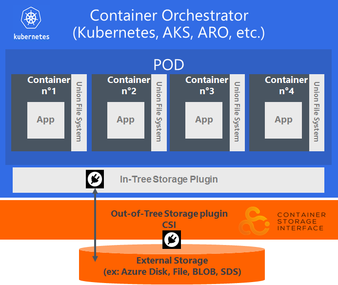

# ARO Public cluster &amp; storage 101

# Introduction
This is an introduction to play with Storage integration in ARO : OCS (Ceph) vs Azure Disk + File + Blob, Storage types (GRS, etc)

## **Disclaimer**

**The features described in this workshop might be not yet production-ready, we enable preview-features for the purpose of learning.**

See also :

- [Azure ARO docs](https://docs.microsoft.com/en-us/azure/openshift/tutorial-create-cluster)
- [ARO 4.x storage docs](https://docs.openshift.com/aro/4/storage/understanding-persistent-storage.html)
- [http://aroworkshop.io](http://aroworkshop.io)
- [https://github.com/akamenev/aro-private](https://github.com/akamenev/aro-private)
- [https://github.com/stuartatmicrosoft/azure-aro/blob/master/aro4-replace-pull-secret.sh](https://github.com/stuartatmicrosoft/azure-aro/blob/master/aro4-replace-pull-secret.sh)
- [https://kubernetes.io/docs/concepts/storage/persistent-volumes/#access-modes](https://kubernetes.io/docs/concepts/storage/persistent-volumes/#access-modes)

## [PV with CSI in ARO](https://docs.openshift.com/aro/4/storage/persistent_storage/persistent-storage-csi.html)

| Term                              |      Definition      |
|-----------------------------------|--------------------|
| Container Storage Interface (CSI) | A specification attempting to establish an industry standard interface that Container Orchestration Systems (COs) can use to expose arbitrary storage systems to their containerized workloads.|
| in-tree                           | Code that exists in the core Kubernetes repository. |
| out-of-tree                       | Code that exists somewhere outside the core Kubernetes repository. |
| CSI Volume Plugin                 | A new, in-tree volume plugin that acts as an adapter and enables out-of-tree, third-party CSI volume drivers to be used in Kubernetes. |
| CSI Volume Driver                 | An out-of-tree CSI compatible implementation of a volume plugin that can be used in Kubernetes through the Kubernetes CSI Volume Plugin. |

1. [ARO does not ship with any CSI drivers](https://docs.openshift.com/aro/4/storage/persistent_storage/persistent-storage-csi.html), it uses [Kubernetes PV framework](https://kubernetes.io/docs/concepts/storage/volumes/#azuredisk) aka in-tree plugin. These volume plugins were “in-tree” meaning their code was part of the core k8s code and shipped with the core Kubernetes binaries.

2. ARO supports :
   - kubernetes.io/azure-disk kubernetes.io/azure-file & provisioners
   - CSI Drivers, FlexVol, hostPath
   - Red Hat OpenShift Container Storage, a provider of agnostic persistent storage [SDS using CEPH](https://www.openshift.com/blog/openshift-container-storage-4-introduction-to-ceph)

CSI Migration is in [Beta](https://kubernetes.io/blog/2019/12/09/kubernetes-1-17-feature-csi-migration-beta) (requires k8s v1.17). 
Timeline/status : GA Target v1.19
When [enabled](https://kubernetes.io/docs/reference/command-line-tools-reference/feature-gates/#feature-gates-for-alpha-or-beta-features), CSI Migration feature shims all plugin operations from the existing in-tree plugin
   - for azureDisk to the disk.csi.azure.com CSI driver
   - for azureFile to the file.csi.azure.com CSI driver

## ToC

1. Setup [Tools](tools.md)
1. Check [subscription](subscription.md)
1. Setup [environment variables](set-var.md)
1. Setup [pre-requisites](setup-prereq.md)
   1. Create RG
   1. Create Storage
   1. Get a Red Hat pull secret
   1. Setup [Network](setup-network.md)
   <!-- Create [SSH Keys](setup-prereq.md#generates-your-ssh-keys) -->
1. Setup [ARO cluster](setup-aro.md)
1. Setup [HELM](setup-helm.md)
1. Setup CSI drivers
   1. Setup [Azure Disk CSI driver](setup-store-CSI-driver-azure-disk.md)
   1. Setup [Azure File CSI driver](setup-store-CSI-driver-azure-file.md)
   1. Setup [Rook & cephFS CSI driver](setup-store-CSI-driver-ceph.md)